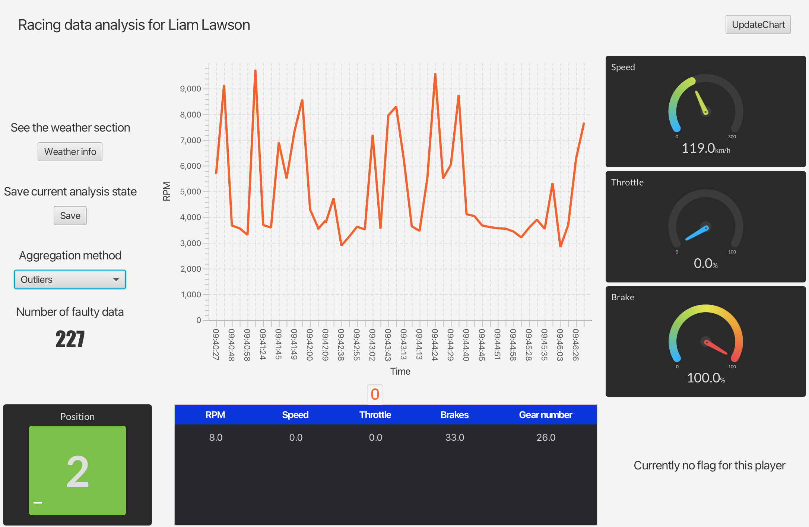
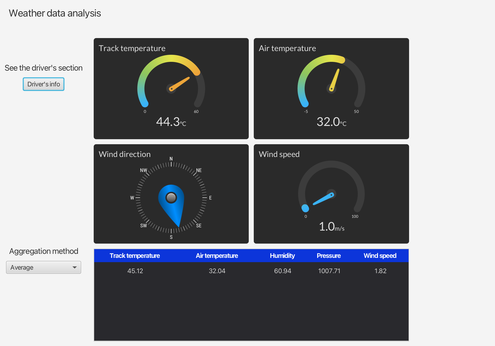

# Formula-1-Dashboard

## Description
Formula-1-Dashboard is a Java application designed to provide real-time information and statistical analysis for a selected Formula 1 race driver. The aim of the project is to create an interactive dashboard that displays various metrics including car speed, throttle, brakes, position, flags, current weather, and temperature.

## Features
- Real-time updates: The dashboard visualizations are updated dynamically as new data from the race becomes available.
- Statistical calculations: The application calculates statistical values such as mean, median, and standard deviation for metrics such as speed, throttle, and brakes.
- Web sockets: Formula-1-Dashboard utilizes web sockets for communication, enabling efficient data transmission between the server and client.
- Integrated server app: The project includes a separate application acting as a server, which retrieves data about the race from the OpenF1 API.

## Technologies Used
- Java
- JavaFX with FXML for the user interface
- Web sockets for communication

## Installation
1. Clone the repository: `git clone https://github.com/your_username/Formula-1-Dashboard.git`
2. Navigate to the project directory: `cd Formula-1-Dashboard`
3. To start the server app, compile and run `DataEmulator/src/main/java/Main.java`
4. To open the dashbord, compile and run `F1RaceApp/src/main/java/wut/f1raceapp/RaceApp.java`

## Dashbord

  
<h3>The driver's information view</h3>

  
  
Figure 1: Information about the driver including: position, speed, throttle, brakes. Plot of RPM in time.  Possibility to save the current state of the race to a text file.

  
<h3>Weather information view</h3>

  
  
Figure 2: Information about the weather during the race including: track and air temperature, wind direction and speed.

## Authors
Hubert Kowalski  
Mateusz Iwaniuk
